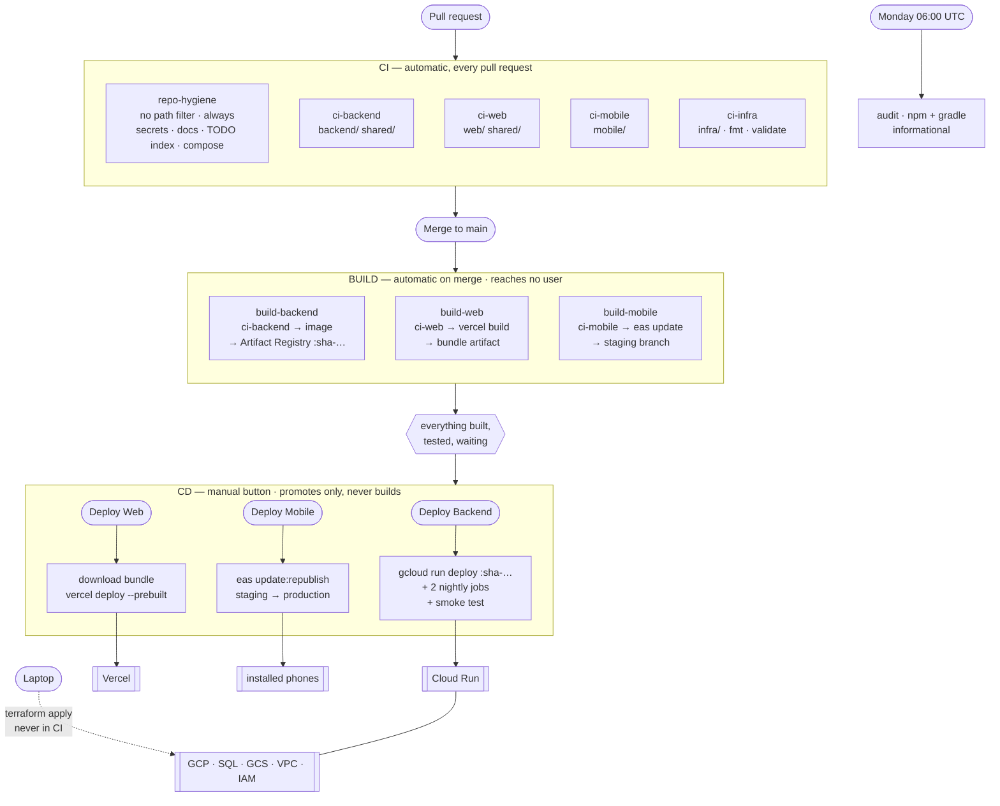

# CI / CD

```mermaid
flowchart TB
  PR([Pull request]) --> CI

  subgraph CI["CI — automatic, every pull request"]
    direction TB
    RH["repo-hygiene<br/>no path filter · always<br/>secrets · docs · TODO index · compose"]
    CB["ci-backend<br/>backend/ shared/"]
    CW["ci-web<br/>web/ shared/"]
    CM["ci-mobile<br/>mobile/"]
    CIF["ci-infra<br/>infra/ · fmt · validate"]
  end

  CI --> MERGE([Merge to main])

  MERGE --> BUILD

  subgraph BUILD["BUILD — automatic on merge · reaches no user"]
    direction TB
    BB["build-backend<br/>ci-backend → image<br/>→ Artifact Registry :sha-…"]
    BW["build-web<br/>ci-web → vercel build<br/>→ bundle artifact"]
    BM["build-mobile<br/>ci-mobile → eas update<br/>→ staging branch"]
  end

  BUILD --> GATE{{"everything built,<br/>tested, waiting"}}

  GATE --> CD

  subgraph CD["CD — manual button · promotes only, never builds"]
    direction TB
    DB(["Deploy Backend"]) --> DBS["gcloud run deploy :sha-…<br/>+ 2 nightly jobs<br/>+ smoke test"]
    DW(["Deploy Web"]) --> DWS["download bundle<br/>vercel deploy --prebuilt"]
    DM(["Deploy Mobile"]) --> DMS["eas update:republish<br/>staging → production"]
  end

  DBS --> RUN[["Cloud Run"]]
  DWS --> VER[["Vercel"]]
  DMS --> EAS[["installed phones"]]

  LAP([Laptop]) -. "terraform apply<br/>never in CI" .-> GCP[["GCP · SQL · GCS · VPC · IAM"]]
  CRON([Monday 06:00 UTC]) --> AUD["audit · npm + gradle<br/>informational"]

  RUN --- GCP
```
